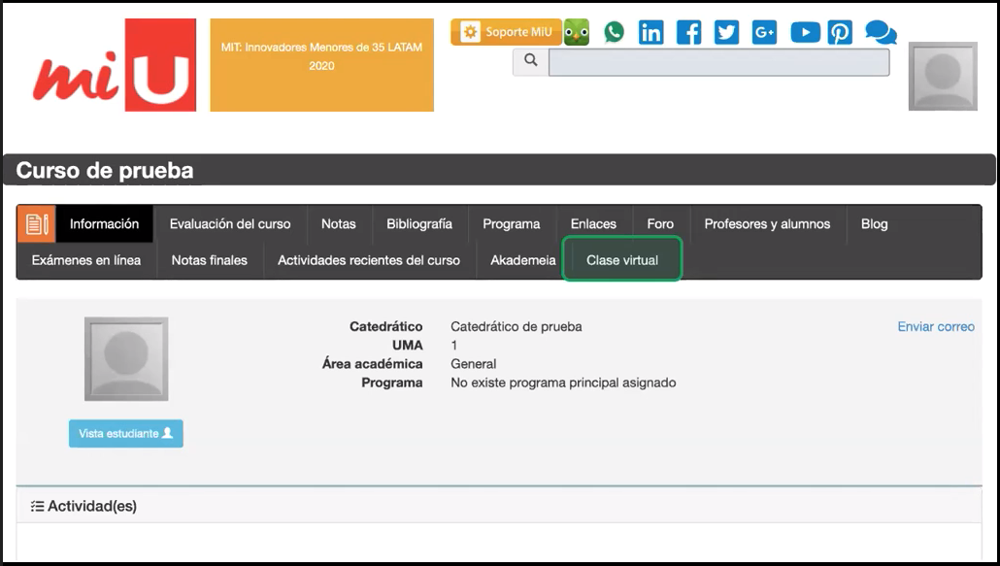

# Computer Science 101 - 2020

Esta sera la pagina que utilizaremos para publicar cualquier proyecto.

!!! danger "NO FORK"
    No hagan fork a este repositorio.

# Clases Virtuales

Cuando ustedes entren a miU, para todos sus cursos encontraran una pestana como en el de la imagen, este boton les aparecera solamente durante el horario de la clase (esto es lo que tengo entendido).

> por ejemplo en nuestra caso solamente aparecera en los horarios de Mier y Vie de 7 a 8:20 am

# [HDT](hdt/index.md)

Solucion de Hojas de Trabajo vistas en clase.
# [Proyectos](projects/projects.md)

Para acceder a la pagina donde se publicaran las instrucciones de los proyectos y mini proyectos, [haga click aqui](projects/projects.md)

# Ejemplos de diferentes lenguajes
Coleccion de ejemplos en clase.

### C

folder [c/](https://github.com/cs-ufm/cs101-2020/tree/master/c) con ejemplos unicamente de Lenguaje C.

### Python

Folder [python/](https://github.com/cs-ufm/cs101-2020/tree/master/c) con ejemplos unicamente para lenguaje Python 3.

### Dudas y preguntas:

Para hacer una pregunta especifica de algun programa en este repositorio proceder a abrir un [`Issue`](https://github.com/cs-ufm/cs101-2020/issues)

Si tiene dudas de que es un Issue por favor lea documentacion:

- [Issue detailed topics](https://help.github.com/en/github/managing-your-work-on-github/managing-your-work-with-issues)
- [docs](https://help.github.com/en/github/managing-your-work-on-github/creating-an-issue)
- [Issue from  code](https://help.github.com/en/github/managing-your-work-on-github/opening-an-issue-from-code)

### Contacto

Si desea contactarme favor enviar un correo a
[jcano@ufm.edu](mailto:jcano@ufm.edu?subject=[CS101-2020]%20Duda%20de%20Curso)
