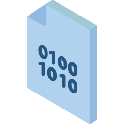

# Mini Proyecto
# Python - Bit Calculator
> Calculadora binaria

Para este proyecto usted realizara una calculadora binaria en Python, usted hara una calculadora de [nibbles](https://en.wikipedia.org/wiki/Nibble)

## Operaciones

1. Suma
2. Resta
